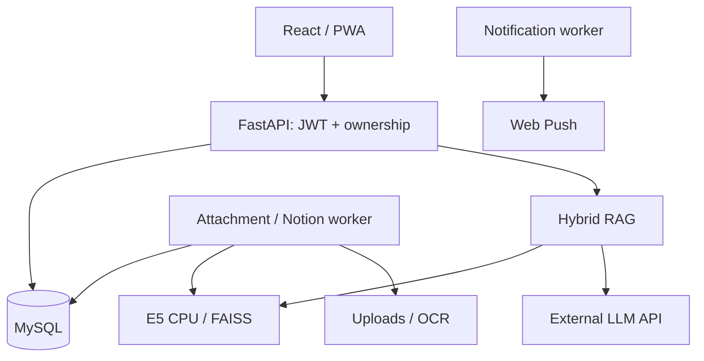
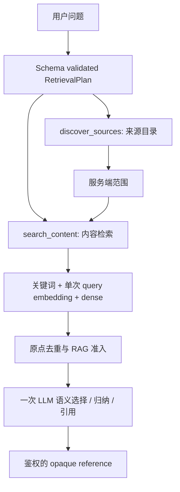

# 系统与 AI 助手架构

## 模块地图

| 模块 | 代码入口 |
|---|---|
| HTTP、JWT、所有权 | backend/app/routes、backend/app/auth.py |
| 问题理解和组合工具 | services/retrieval_plan.py、source_discovery.py |
| 统一检索和生成 | services/ai_retrieval_service.py、ai_stream_retrieve.py |
| 来源描述和准入 | services/source_descriptor.py、relevance_ranker.py |
| 讲解与来源版本 | services/ai_explainer.py、ai_source_set.py、ai_persona_context.py |
| SSE、引用、重放 | services/ai_stream_protocol.py、ai_stream_reference_preview.py、ai_stream_idempotency.py |
| 个性设置和摘要 | services/ai_personalization_context.py、agent_context_builder.py |
| Notion | services/notion_*.py、routes/notion.py |
| Todo 树与知识镜像 | services/todo_hierarchy.py、todo_knowledge.py |
| 前端会话与引用 | frontend/src/hooks/usePersonaChat.ts、components/ai |

上述 services 路径均相对 backend/app；文档用于导航，修改仍须阅读实现和调用方。

## 运行结构

数据库、uploads、索引、日志和模型独立保存；app、worker 使用同一源码构建镜像。
源码开源不包含任何实例的数据。LLM 只收到本请求选中的证据，但仍属于外部数据处理。

## 问题理解与检索

- 来源属性与主题分离，Notion 是 provider，不向每篇正文硬塞 Notion 关键词。
- 文档目录支持分组与分页；同步中的对象可被发现，但不能冒充已索引回答证据。
- 检索鼠每轮独立。准入后的模型输入受 48 条、14,000 字符预算约束，不是固定发送 48 条。
- 提示词约束不能替代权限校验。模型只见安全别名，服务端保留真实身份映射。
- 生成失败使用稳定错误或有限降级；不把故障说成没有数据。

## 讲解鼠

首问候选 → 用户确认 v1 → 当前来源追问。补充来源需要明确主题，确认后 append-only v2。
普通追问不自动扩大范围。Todo 固定身份并读最新状态；删除或失权使来源失效。
Notion 页面同步资格、用户所有权和 opaque token 在预览及生成前重新校验。
会话摘要只控制上下文预算，不修改来源版本。

## 可靠性与演进边界

- request_id、durable claim、lease 和 heartbeat 处理重复、取消与续流。
- Todo/Notion mirror 使用 content hash 校验，旧向量不能配新正文。
- 记录族保留原始顺序和精确附件身份；Todo 按人工顺序和父链展开。
- 用户数据按 user_id 过滤；个性设置不加入来源编号。
- 整理鼠维护中，不将保留的实现描述为已开放功能。
- 不依赖隐藏的模型训练或私有向量库；外部 API 凭据由部署者提供。
